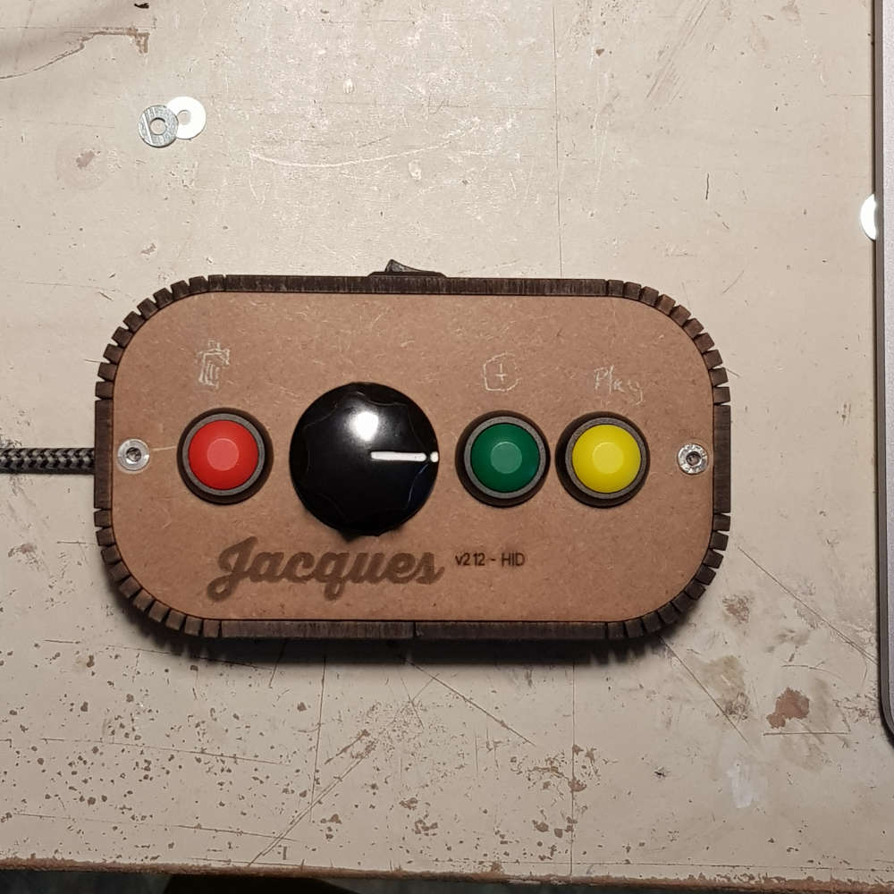

# Jacques® : interface pour Animator®

Animator peut se compléter avec un petit boitier, une interface physique (tangible).
Le boitier comprend 3 boutons et un encodeur rotatif.  
Je disposais d'un lot de boutons colorés, j'en ai profité pour les intégrer au montage.
Le boitier est alimenté et communique via le cable usb-c.  
Il envoie des équivalents claviers pour chaque type d'opération. Et permet donc de simplifier certaines manipulations.

Une version spéciale d'Animator, estampillée v9, permet de tenir compte de nouveaux raccourcis claviers. Son usage sans le boitier est légèrement différent.  

Dans la **version 8**, la flèche de droite permet de se déplacer "en avant" dans l'animation et de rajouter une image lorsque l'on est à la dernière. Pour éviter l'ajout intempestifs d'images avec l'encodeur rotatif. Le comportement a été modifié.   

Dans la **version 9**, les flèches permettent uniquement le déplacement dans l'animation (l'encodeur envoie des équivalents clavier de flèches).  
Lorsqu'on atteint les bords de l'animation, un fond blanc apparaît brièvement.  
Pour ajouter une image, il faut appuyer sur le bouton vert (sur "ENTRÉE" au clavier), une image est ajoutée après l'image en cours et devient l'image en cours.  
Pour supprimer une image, il faut utiliser le bouton rouge (sur "BACKSPACE" au clavier) qui est placé de l'autre coté de l'encodeur. On supprime l'image encours.  
Le bouton Jaune ("barre d'espace" au clavier), quand à lui, permet la lecture/pause de l'animation.

Techniquement la boite contient un micro-contrôleur RP2040, codé en circuitPython.   
L'usb, le REPL et le midi ont été désactivés, pour simplifier l'usage du boitier (en évitant l'apparition du device sur la chaine usb ou midi).  

Un bouton "boot-code" (sur le côté opposé au cable) permet lorsqu'il est appuyé, au branchement à l'ordinateur, de réactiver les fonctions REPL et usb pour la mise à jour du code.  

Le boitier envoie des équivalents claviers, pour éviter de parasiter le comportement de l'ordinateur, si ce n'est pas Animator qui est au premier plan, un interrupteur (en haut sur la photo) permet de bloquer l'envoie des touches clavier (ça évite de le débrancher sans cesse).

Les boutons sont connectés aux entrées du µc et mis à la terre.  
L'interrupteur et le bouton **bootcode**, sont connectés à  la pin **3V3** du µc plutôt que le **GND** (aucune raison particulière, une reprise de code existant sans harmonisation)

Le dossier _**lasercut**_ contient les fichiers de découpe laser du boitier (en laserworks, dxf et pdf). La boîte à été réalisée grâce au plugin de générateur de boites[^1] pour Inskape, de Thierry, du fablab de Lannion (grand merci pour ce fabuleux plugin fort utile).

Le dossier circuitpython, contient le code pour un **RP2040 pico zero** de _Waveshare_ (petit gabarit, pas cher). Il s'adaptera facilement à tout autre pico (il suffit de faire correspondre les noms des io et les numéros).

La Police de caractère du nom, est la **Thirsty Soft**[^2] Black de Yellow Design Studio. La police Single Line est la **SLF Architect**[^3].

[^1]: le plugin [générateur de boites](https://wiki.fablab-lannion.org/index.php?title=Generateur_de_boites)
[^2]: [Yellow Design Studio](https://yellowdesignstudio.com/collections/thirsty-soft)
[^3]: chez [Singlelinefonts](https://www.singlelinefonts.com/products/slf-architect-for-inkscape-and-fontlab-pad)
